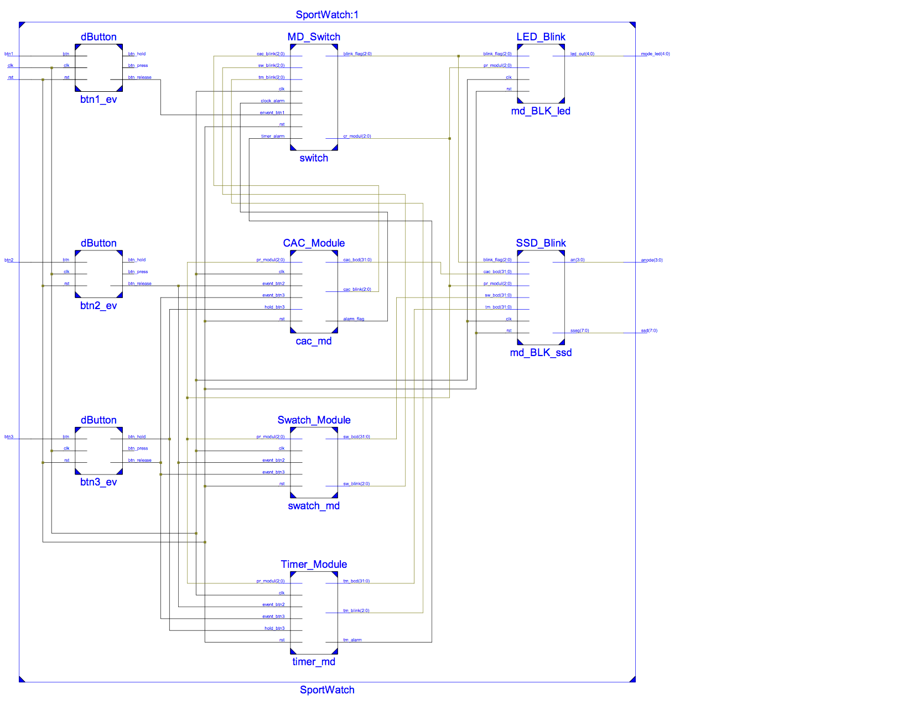

# VHDL-SmartWatch
##Task:
Using only the resources available in the NEXYS 3, namely switches, leds, press buttons, 7-segment displays, etc. to design an alarm clock. Add other features like:

* 12h or 24h option; 
* A simple calendar with day/month or perpetual calendar with day/month/year; 
* Days of the week; 
* A chronometer with stopwatch and lap timer; 
* Incremental speed when setting clock, alarm clock or calendar; 
* Any other creative features!

##Design
--
(**TEAM MEMBERS: Qinghui. Liu, Zhili. Shao, Joseph. Fotso**)

We use three buttons (Btn1, Btn2, and Btn3), that are used to change the mode, set the time, set the alarm, set date, start/stop the stopwatch, set/start timer and so on, to implement all required functions of the digital clock. 4-digit 7-segment LCD will be use to display kinds of information, like date, clock, timer etc. upon the mode selected. 

Pushing Btn1 changes the mode from Clock to Alarm, Calendar, Stopwatch, Timer, and then back to Clock. 5 LEDs will be used to indicate which mode is selected by lit on. The functions of Btn2 and Btn3 vary upon the mode selected by users, as below… 

- **Operation in Clock mode**: 
The display will show the time using the format hh.mm (24hour). During this mode, Pushing Btn2 changes the state to Set Hours or Set Minutes and back to Clock Mode. When in Set Hours or Set Minutes state, a long press (hold) of Btn3 increases the hour or the minutes by 1 with incremental speed from per 1 sec to 0.2 sec. 

- **Operation in Alarm mode**: 
The display will show the alarm time format hh.mm (24H). Pushing Btn2 changes the state to Set Alarm Hours or Set Alarm Minutes and then back to Alarm. When in the Set Alarm Hours or Set Minutes state, each long press (hold) of Btn3 increases the hour or the minutes by 1 with incremental speed from per 1 sec to 0.2 sec. When in the Alarm state, Pressing Btn3 resets the alarm. Once the alarm starts “ringing”, alarm LED will flicker for 50 seconds and then stop itself. It can also be stopped manually by pressing B3. 

- **Operation in Calendar mode**: 
The display will show the date with the format mm.dd. During this mode. Pushing Btn2 will switch between the following states: Month, Days, Years, days of week, and back to Calendar Mode. When in Set Months or Set Days or Set Years state, or Set days of week, each long press (hold) of Btn3 increases the hour or the minutes by 1 with incremental speed from per 1 sec to 0.2 sec. 

- **Operation in Stopwatch mode**: 
The display indicates stopwatch time in the format mm.ss. Pressing Btn2 starts the time counter (Counting state), Pressing Btn2 again stops it (Pausing state), and then pressing Btn2 resumes it (Counting state), and so on. However, during Counting state, Press Btn3, a lap time will be stored and “frozen” on the display (Lap time mode, Stopwatch continues running in the background or can be stopped) until pressed Btn3 again. During other modes, Pressing Btn3 will reset the stopwatch to zero. Once the stopwatch is started, it will keep running even when in Clock or Alarm or Calendar, and Timer mode. 

- **Operation in Timer mode**: 
The display will show the timer format hh.mm. Pushing Btn3 changes the state to Set Hours or Set Minutes and then back to Timer. When in the Set Hours or Set Minutes state, each long press (hold) of Btn3 increases the hour or the minutes by 1 with incremental speed from per 1 sec to 0.2 sec. When in the Timer state, Pressing Btn3 start or cancel the timer. Once the timer starts, it can also be pause or resume by pressing Btn2.

##Block Diagram

